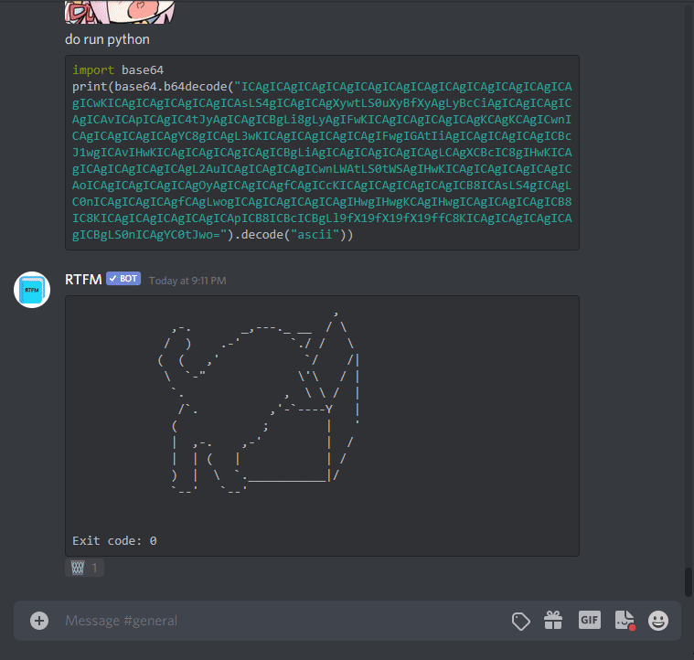

# BDImgurStickers

Quicky send images from an Imgur album by selecting them from a menu.

## Install

1. Install [BetterDiscord](https://rauenzi.github.io/BetterDiscordApp/)
2. Download the [latest release](https://github.com/jasonliang-dev/bd-imgur-stickers/releases/download/v0.0.7/imgur-stickers.plugin.js)
3. Move the downloaded file into the plugins folder. On Windows, the plugins folder should be located at `%appdata%\BetterDiscord\plugins`
4. In Discord > User Settings > Plugins, Enable BDImgurStickers.

## Usage

Find or create an Imgur album. You'll need the album ID from it. You
can get the album ID by copying the end of an Imgur album link:
https://imgur.com/a/<album ID here>.

Near the right of the message box, click on the leftmost button in the
button group (the one that looks like a tag). This opens the sticker
menu. Paste the album ID in the input area at the top of the
menu. This will populate the menu with images. Click on an image to
send it to the current Discord channel.
